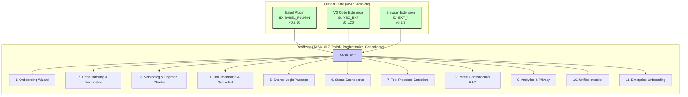

# Traceform: Current State & Roadmap

This document visualizes the current state of the core Traceform tools following the MVP completion and outlines the planned future work under TASK_017.

*   **Current State:** Shows the three core components that form the Traceform MVP, along with their latest published versions.
*   **Roadmap:** Outlines the subtasks defined within TASK_017, which focuses on polishing, productionizing, and potentially consolidating the toolset for a better developer experience.

*(This visualization is based on information from `memory_docs/codeMap_root.md` and `memory_docs/activeContext.md` as of 2025-04-16)*
