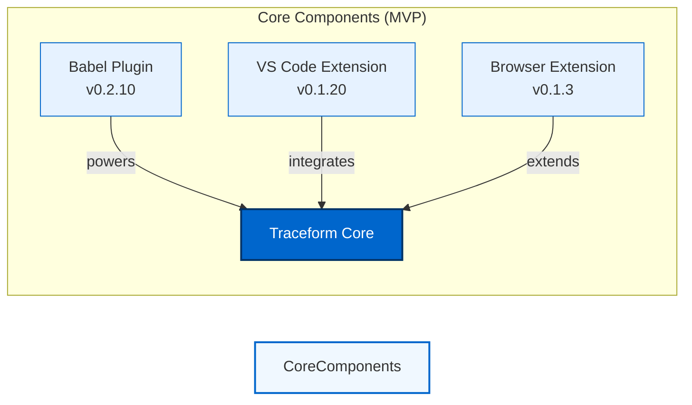
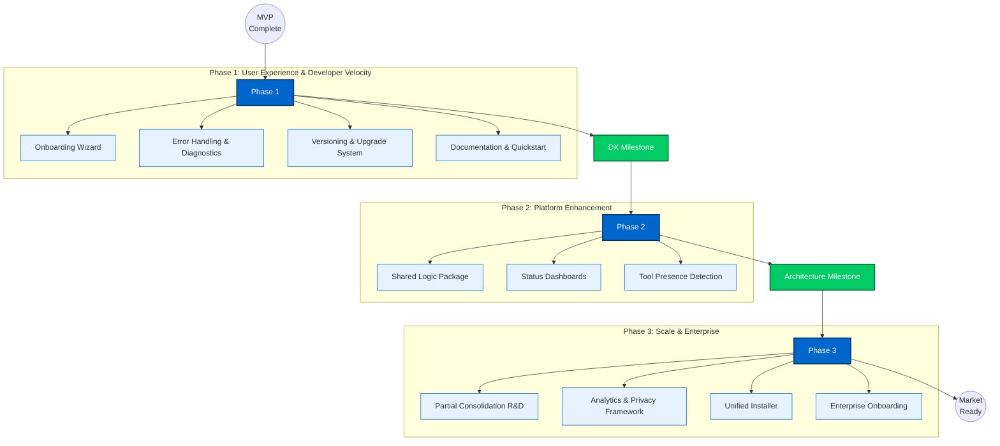

# Traceform: Vision & Execution Path

We've reached our first milestone with Traceform's MVP. This is just the beginning of something that will fundamentally change how developers interact with their tools. Here's where we stand and where we're headed next.

## Current State: Foundations Built

## Our Path Forward: 

## What This Means

### Phase 1: User Experience & Developer Velocity
We're removing friction. The first experience with Traceform should be seamless, with clear guidance when things go wrong and documentation that makes complex concepts simple. This isn't just about polish, it's about making the powerful accessible.

### Phase 2: Platform Enhancement
We're building the connective tissue. By creating a shared foundation, we'll accelerate development across all tools while giving users unprecedented visibility into their workflow. This is where Traceform starts becoming greater than the sum of its parts.

### Phase 3: Scale & Enterprise
We're preparing for growth. As we explore deeper integration possibilities, we'll also build the infrastructure needed for broad adoption, balancing powerful analytics with privacy by design and making deployment trivial whether you're an individual developer or a Fortune 500.

## Why This Matters

What we're building isn't just another developer tool, it's a new way of thinking about how we interact with technology. Each phase brings us closer to a world where the boundaries between tools disappear and developers can focus entirely on creation.

The MVP proved the concept. The roadmap shows how we'll turn it into reality. Let's build.

— Traceform Team
