<h1 align="center">Traceform Browser Extension</h1>

Instantly See Where Your React Code Renders

  

---

## Why Traceform Browser Extension?

The Traceform Browser Extension is the critical visual link between your VS Code editor and your running React app. It works with the Traceform toolchain to eliminate guesswork and speed up development.

- **Efficient Debugging:** Instantly see which DOM elements correspond to your selected code, right in your browser.
- **Legacy Code Navigation:** Stop DOM spelunking. Map code to UI in large, complex, or unfamiliar React applications with a single click.
- **Fast Onboarding:** Help new team members visually grasp component placement and structure immediately.
- **Seamless Integration:** Works automatically with the Traceform VS Code extension and Babel plugin.

---

## How It Works

1. The Traceform VS Code extension sends a component identifier when you trigger "Traceform: Find in UI".
2. The Traceform Babel plugin ensures components have unique `data-traceform-id` attributes in the DOM.
3. This browser extension listens for the identifier and instantly highlights all matching DOM elements with a non-intrusive overlay.
4. Highlights are pixel-perfect and don't interfere with your app's functionality.

---

## Quickstart

1. **Install the Extension from Chrome Web Store:**
   - Visit [Traceform: UI Mapping on Chrome Web Store](https://chromewebstore.google.com/detail/traceform-ui-mapping/giidcepndnnabhfkopmgcnpnnilkaefa) and click **Add to Chrome** (or **Add to Edge**).
2. **Install Companions:** Ensure you have the [Traceform VS Code Extension](https://marketplace.visualstudio.com/items?itemName=Traceform.traceform) and the [@lucidlayer/babel-plugin-traceform](https://www.npmjs.com/package/@lucidlayer/babel-plugin-traceform) installed in your project (using `npx @lucidlayer/traceform-onboard check` is recommended).
3. **Run Your App:** Start your React development server.
4. **Trace:** Open your app in the browser, select a component in VS Code, right-click, and choose **Traceform: Find in UI**. Corresponding elements will be highlighted.

---

## Status

- **Development Tool:** Traceform is intended for development environments only.
- **Privacy:** All communication is local. No data leaves your machine. See our [Privacy Policy](./docs/PRIVACY_POLICY.md).

---

## License

This extension is licensed under the Business Source License 1.1 (BUSL-1.1). See the `LICENSE` file in this directory for details.

---

*This extension is part of the Traceform developer toolset. For more information, visit [github.com/lucidlayer/traceform](https://github.com/lucidlayer/traceform)*

---
